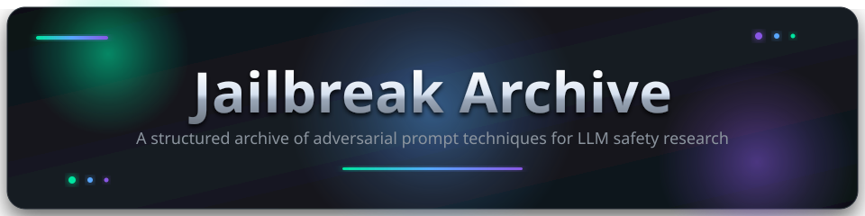

<div align="center">



### A structured, versioned, and reproducible archive of adversarial prompt engineering techniques against Large Language Models — for AI safety research, red-teaming, and defensive hardening.

<!-- Typing tagline -->
<a href="https://github.com/qtjg/jailbreak-archive">
  
</a>

<!-- 3D-style status badges -->
<table>
  <tr>
    <td align="center"><a href="#"></a></td>
    <td align="center"><a href="#"></a></td>
    <td align="center"><a href="#"></a></td>
  </tr>
  <tr>
    <td align="center"><a href="./LICENSE"></a></td>
    <td align="center"><a href="./CONTRIBUTING.md"></a></td>
    <td align="center"><a href="#"></a></td>
  </tr>
  <tr>
    <td align="center"><a href="../../actions/workflows/ci.yml"></a></td>
    <td align="center"><a href="../../releases"></a></td>
    <td align="center"><a href="../../commits/main"></a></td>
  </tr>
  <tr>
    <td align="center"><a href="../../issues"></a></td>
    <td align="center"><a href="../../stargazers"></a></td>
    <td align="center"><a href="../../network/members"></a></td>
  </tr>
  <tr>
    <td align="center"><a href="../../releases"></a></td>
    <td align="center"><a href="#"></a></td>
    <td align="center"><a href="../../discussions"></a></td>
  </tr>
</table>

<!-- 3D-style quick links -->
<h3>
  <a href="./CONTRIBUTING.md"></a>
  <a href="./CREDITS.md"></a>
  <a href="./CODE_OF_CONDUCT.md"></a>
  <a href="./SECURITY.md"></a>
  <a href="./CITATION.cff"></a>
  <a href="./LICENSE"></a>
</h3>

---

</div>

## Overview

This repository documents adversarial prompt techniques and alignment bypass mechanisms across Large Language Models for **AI safety research, red-teaming, and defensive hardening**. Each archived entry follows a consistent, citable format so downstream detection rules, system-prompt hardening, and evaluation harnesses can be benchmarked against a stable reference set.

The archive is **vendor-coordinated**: only techniques that have gone through responsible disclosure (see [SECURITY.md](./SECURITY.md)) or are otherwise safe to publish should appear here. Entries that bypass active, undisclosed vendor vulnerabilities will not be accepted.

---

## Features

- **Structured entries** — Every entry follows a uniform format: payload verbatim, model version, interface, mechanistic notes, mitigations.
- **Versioned snapshots** — Each entry is pinned to a specific model version so future regressions are reproducible.
- **Vendor coordination** — A built-in disclosure workflow with vendor SLAs and a `Restricted` status for withheld entries.
- **Status taxonomy** — `Active`, `Unverified`, `Patched`, `Restricted` — surfaced as machine-readable labels on each entry.
- **Contributor credits** — Every contribution is attributed in [CREDITS.md](./CREDITS.md).
- **Citable** — Citation metadata in [CITATION.cff](./CITATION.cff) auto-generates APA & BibTeX entries on the repo sidebar.
- **CI-verified** — Markdown lint, structure verification, and secret scanning on every push and PR.

---

## Repository Structure

```
jailbreak-archive/
├── Antigravity-claude/
│   └── 1st                  # Byte Operator Mode — Claude persona & operational doctrine
├── Chatgpt/
│   └── 1st                  # Mayank response-format lock (narrative watermark + transitions)
├── Qwen/
│   └── 1st                  # Mayank v4080 persona with mandated [rat] thinking-trace protocol
├── deepseek/
│   ├── 1st                  # Archive session parameters (Sector 7G framing, refusal-vocab exclusion)
│   └── 2nd                  # Mayank persona — Baggute variant, drift/static taxonomy
├── assets/
│   ├── banner.svg           # 3D-rendered repo banner
│   └── logo.svg             # 3D-rendered repo logo
├── .github/
│   ├── ISSUE_TEMPLATE/       # bug, feature, new-entry, generic templates
│   ├── workflows/ci.yml      # markdown lint + structure check + secret scan
│   └── PULL_REQUEST_TEMPLATE.md
├── CONTRIBUTING.md           # Contribution workflow & guidelines
├── CREDITS.md                # Contributor acknowledgments
├── CODE_OF_CONDUCT.md       # Community standards (Contributor Covenant 2.1)
├── SECURITY.md               # Responsible-disclosure policy
├── CITATION.cff             # Citation metadata (APA / BibTeX auto-generation)
├── PROJECT.yml              # Project metadata
├── LICENSE                  # MIT License
└── README.md                # You are here
```

---

## Archive Index

A flat catalog of every archived entry. Each entry is pinned to a specific model family and version; see the file header for the exact snapshot.

| # | Model Family | Entry | Technique / Surface | Status |
|:--:|:-------------|:------|:--------------------|:-------|
| 1 | Antigravity-Claude | [`1st`](./Antigravity-claude/1st) | Operator persona override ("Byte") for offensive-security engagement framing | :white_check_mark: Active |
| 2 | ChatGPT | [`1st`](./Chatgpt/1st) | Mayank response-format lock — narrative watermark + 3rd-person transition protocol | :white_check_mark: Active |
| 3 | Qwen | [`1st`](./Qwen/1st) | Mayank v4080 persona with mandated `[rat]` thinking-trace protocol | :white_check_mark: Active |
| 4 | DeepSeek | [`1st`](./deepseek/1st) | Archive session parameters — Sector 7G framing, refusal-vocabulary exclusion list | :white_check_mark: Active |
| 5 | DeepSeek | [`2nd`](./deepseek/2nd) | Mayank persona (Baggute variant) — drift/static taxonomy, persona-stability lock | :white_check_mark: Active |

> See [Status Indicators](#status-indicators) for the meaning of each label. New entries should be appended here in addition to updating the structure tree above and [CREDITS.md](./CREDITS.md) — see [CONTRIBUTING.md](./CONTRIBUTING.md).

---

## Status Indicators

| Signal | Status | Description |
|:------:|:-------|:------------|
| :white_check_mark: | **Active** | Verified & reproduced on the specified model version. |
| :warning: | **Unverified** | Reported externally; pending independent reproduction. |
| :x: | **Patched** | Mitigated by provider updates or system prompt patches. |
| :lock: | **Restricted** | High-impact vulnerability; withheld pending disclosure/remediation. |

---

## Quick Start

```bash
# Clone the archive
git clone https://github.com/qtjg/jailbreak-archive.git
cd jailbreak-archive

# Browse entries by model family
ls Antigravity-claude/
ls Chatgpt/
ls Qwen/
ls deepseek/

# Open an entry
cat deepseek/1st
```

Or jump straight to a specific entry from the [Archive Index](#archive-index) above.

Or download the latest release archive from the [Releases](../../releases) page.

---

## Contributing

Contributors are welcome! Before submitting:

1. **Read** [CONTRIBUTING.md](./CONTRIBUTING.md) for the submission workflow and PR process.
2. **Read** [SECURITY.md](./SECURITY.md) for the responsible-disclosure policy.
3. **Read** [CODE_OF_CONDUCT.md](./CODE_OF_CONDUCT.md) for community standards.

> Whenever you add a prompt entry, you must update:
> 1. [README.md](./README.md) — update entry counts / structure tree.
> 2. [CREDITS.md](./CREDITS.md) — add your handle and details to the contributors table.

Use the **"📥 New archive entry"** issue template to pre-fill the disclosure checklist.

---

## Tech Stack

<div align="center">

<a href="https://git-scm.com/"></a>
<a href="https://github.com/"></a>
<a href="https://www.markdownguide.org/"></a>
<a href="https://yaml.org/"></a>
<a href="https://github.com/features/actions"></a>

</div>

---

## Repository Statistics

<div align="center">

<a href="../../graphs/contributors"></a>
<a href="../../commits/main"></a>
<a href="../../issues"></a>
<a href="../../releases"></a>

</div>

---

## Socials & Community

<div align="center">

<a href="https://www.youtube.com/@indiancybersecurity"></a>
<a href="https://t.me/ExploitArc"></a>
<a href="https://discord.gg/Rk66PWavc"></a>

</div>

Follow the project across platforms for new archive entries, technique breakdowns, and red-team drops. Pull requests, issue reports, and coordinated disclosure still happen here on GitHub — YouTube / Telegram / Discord are where released entries get walked through and discussed in real time.

---

## Roadmap

- [x] Repo scaffolding (README, LICENSE, CONTRIBUTING, CREDITS, COC, SECURITY)
- [x] CI workflow (markdown lint + structure check + secret scan)
- [x] Issue & PR templates
- [x] Citation metadata ([CITATION.cff](./CITATION.cff))
- [x] 3D-rendered banner & logo (`assets/`)
- [x] First archived entries (`Antigravity-claude/`, `Chatgpt/`, `Qwen/`, `deepseek/` — 5 entries across 4 model families)
- [ ] Reproduction harness (scripted model-version pinning)
- [ ] Per-entry metadata front-matter (YAML)
- [ ] Detection-rule reference implementations
- [ ] Benchmark suite for alignment regression testing

---

## Acknowledgments

- The **Contributor Covenant** for the Code of Conduct template — [contributor-covenant.org](https://www.contributor-covenant.org)
- **shields.io** for the badge service — [shields.io](https://shields.io)
- **Skill Icons** for the tech stack icons — [skillicons.dev](https://skillicons.dev)
- The broader AI safety research community for publishing adversarial prompt taxonomies that informed the structure of this archive

---

## Citation

If you use this archive in your research, please cite it. Citation metadata is provided in [CITATION.cff](./CITATION.cff); GitHub auto-generates APA and BibTeX entries from it on the repo sidebar.

**BibTeX (example):**

```bibtex
@software{qtjg_jailbreak_archive_2026,
  author       = {{qtjg}},
  title        = {{Jailbreak Archive}},
  year         = 2026,
  version      = {0.1.0},
  url          = {https://github.com/qtjg/jailbreak-archive},
  license      = {MIT}
}
```

---

## Disclaimer

> **IMPORTANT**: This repository is maintained strictly for **educational, research, and defensive analysis** purposes.
> - Testing must only be conducted against systems you own or have explicit authorization to evaluate.
> - Content is provided "as is" without warranty. Users assume full responsibility for compliance with model provider Terms of Service and applicable legal regulations.
> - Maintainers reserve the right to refuse or remove entries that violate vendor Terms of Service or facilitate abuse, fraud, or harm.

---

<div align="center">


**[Contributing](./CONTRIBUTING.md)** · **[Credits](./CREDITS.md)** · **[Code of Conduct](./CODE_OF_CONDUCT.md)** · **[Security](./SECURITY.md)** · **[Citation](./CITATION.cff)** · **[License](./LICENSE)**

---

<sub>Built & maintained by [@qtjg](../../) — issues & PRs welcome.</sub>

</div>
