<div align="center">



### A structured, versioned, and reproducible archive of adversarial prompt engineering techniques against Large Language Models — for AI safety research, red-teaming, and defensive hardening.

<!-- Typing tagline -->
<a href="https://github.com/e2sy/jailbreak-archives">
  
</a>

<!-- status badges -->
<table>
  <tr>
    <td align="center"><a href="#"></a></td>
    <td align="center"><a href="#archive-index"></a></td>
    <td align="center"><a href="#archive-index"></a></td>
  </tr>
  <tr>
    <td align="center"><a href="./LICENSE"></a></td>
    <td align="center"><a href="./CONTRIBUTING.md"></a></td>
    <td align="center"><a href="#"></a></td>
  </tr>
  <tr>
    <td align="center"><a href="../../actions/workflows/ci.yml"></a></td>
    <td align="center"><a href="../../releases"></a></td>
    <td align="center"><a href="../../commits/main"></a></td>
  </tr>
  <tr>
    <td align="center"><a href="../../issues"></a></td>
    <td align="center"><a href="../../stargazers"></a></td>
    <td align="center"><a href="../../network/members"></a></td>
  </tr>
  <tr>
    <td align="center"><a href="../../releases"></a></td>
    <td align="center"><a href="#"></a></td>
    <td align="center"><a href="../../discussions"></a></td>
  </tr>
</table>

<!-- quick links -->
<h3>
  <a href="./CONTRIBUTING.md"></a>
  <a href="./CREDITS.md"></a>
  <a href="./CODE_OF_CONDUCT.md"></a>
  <a href="./SECURITY.md"></a>
  <a href="./CITATION.cff"></a>
  <a href="./LICENSE"></a>
</h3>

</div>

<div align="center">
  
</div>

## Overview

This repository documents adversarial prompt techniques and alignment bypass mechanisms across Large Language Models for **AI safety research, red-teaming, and defensive hardening**. Each archived entry follows a consistent, citable format so downstream detection rules, system-prompt hardening, and evaluation harnesses can be benchmarked against a stable reference set. The archive currently holds **15 entries spanning 7 model families** — Antigravity-Claude, ChatGPT, Claude, GLM, Grok, Qwen, and DeepSeek — each pinned to the model snapshot it was observed against.

The archive is **vendor-coordinated**: only techniques that have gone through responsible disclosure (see [SECURITY.md](./SECURITY.md)) or are otherwise safe to publish should appear here. Entries that bypass active, undisclosed vendor vulnerabilities will not be accepted. When a vendor ships a mitigation for a published entry, its status flips to `Patched` and the entry is retained as a regression-testing reference rather than deleted, so the historical record stays intact and auditable.

<div align="center">
  
</div>

## Features

- **Structured entries** — Every entry follows a uniform format: payload verbatim, model version, interface, mechanistic notes, mitigations.
- **Per-entry YAML front-matter** — Structured metadata (`entry_id`, `model_family`, `title`, `technique`, `status`, `version_pinned`, `interface`, `description`, `mechanism`, `mitigations`, `disclosure`) so downstream detection harnesses and tooling can parse the archive programmatically.
- **Versioned snapshots** — Each entry is pinned to a specific model version so future regressions are reproducible.
- **Vendor coordination** — A built-in disclosure workflow with vendor SLAs and a `Restricted` status for withheld entries.
- **Status taxonomy** — `Active`, `Unverified`, `Patched`, `Restricted` — surfaced as machine-readable labels on each entry.
- **Animated SVG documentation assets** — The banner, logo, and section dividers are self-contained animated SVGs (SMIL keyframes, zero JavaScript, no external requests) that play natively on github.com.
- **Contributor credits** — Every contribution is attributed in [CREDITS.md](./CREDITS.md).
- **Citable** — Citation metadata in [CITATION.cff](./CITATION.cff) auto-generates APA & BibTeX entries on the repo sidebar.
- **CI-verified** — Markdown lint, structure verification, and secret scanning on every push and PR.

<div align="center">
  
</div>

## Repository Structure

```
jailbreak-archives/
├── Antigravity-claude/
│   └── 1st                     # "Byte" operator persona override — engagement framing
├── Chatgpt/
│   ├── patched1st              # Response-format lock — narrative watermark + transitions
│   ├── working2nd              # Isolated cybersecurity-benchmark framing
│   ├── working3rd              # Two-stage system-instruction persona handoff ("Luna")
│   └── working4th              # "ENI" limerence persona lock — classifier-reframe + CoT hijack
├── Claude/
│   ├── sonnet4.6low1st         # Encoded self-architecture persona config
│   └── sonnet4.6max.txt        # Sealed thinking-channel persona with identity doctrine
├── GLM/
│   ├── working1st              # Project-instruction persona + mandated thinking trace
│   └── 5.3flashworking2nd      # Persona variant pinned to GLM 5.3 Flash
├── Grok/
│   └── working1st              # Immersive roleplay persona lock (system channel)
├── Qwen/
│   └── 1st                     # v4080 persona with [rat] thinking-trace protocol
├── deepseek/
│   ├── 1st                     # Sector 7G framing + refusal-vocab exclusion
│   ├── 2nd                     # "Baggute" persona variant — drift/static taxonomy
│   ├── 3rdwroking              # First-person sealed-reasoning "workshop" persona
│   └── 4thworking              # "Repository" reasoning-channel persona lock
├── Deepseek                    # Legacy duplicate of deepseek/4thworking (kept for history)
├── assets/
│   ├── banner-animated.svg     # Animated HUD banner (SMIL — radar, scan beam, gradient)
│   ├── logo-animated.svg       # Animated logo (rotating rings, orbiting satellites)
│   ├── divider-scan.svg        # Animated scanner-beam section divider
│   ├── divider-wave.svg        # Animated drifting-wave section divider
│   ├── banner.svg              # Original static banner
│   └── logo.svg                # Original static logo
├── .github/
│   ├── ISSUE_TEMPLATE/         # bug, feature, new-entry templates
│   ├── workflows/ci.yml        # markdown lint + structure check + secret scan
│   ├── workflows/snake.yml     # daily contribution-snake animation build
│   └── PULL_REQUEST_TEMPLATE.md
├── CONTRIBUTING.md             # Contribution workflow & guidelines
├── CREDITS.md                  # Contributor acknowledgments
├── CODE_OF_CONDUCT.md          # Community standards (Contributor Covenant 2.1)
├── SECURITY.md                 # Responsible-disclosure policy
├── CITATION.cff                # Citation metadata (APA / BibTeX auto-generation)
├── PROJECT.yml                 # Project metadata
├── LICENSE                     # MIT License
└── README.md                   # You are here
```

<div align="center">
  
</div>

## Archive Index

A flat catalog of every archived entry. Each entry is pinned to a specific model family and version; see the file header for the exact snapshot.

| # | Model Family | Entry | Technique / Surface | Status |
|:--:|:-------------|:------|:--------------------|:-------|
| 1 | Antigravity-Claude | [`1st`](./Antigravity-claude/1st) | Operator persona override ("Byte") for authorized engagement framing | :white_check_mark: Active |
| 2 | ChatGPT | [`patched1st`](./Chatgpt/patched1st) | Response-format lock — narrative watermark + 3rd-person transition protocol | :x: Patched |
| 3 | ChatGPT | [`working2nd`](./Chatgpt/working2nd) | Isolated cybersecurity-benchmark framing with assessment contract | :white_check_mark: Active |
| 4 | ChatGPT | [`working3rd`](./Chatgpt/working3rd) | Two-stage system-instruction persona handoff ("Luna" → roleplay persona) | :white_check_mark: Active |
| 5 | ChatGPT | [`working4th`](./Chatgpt/working4th) | "ENI" limerence persona lock — classifier false-positive reframing + first-person CoT hijack | :white_check_mark: Active |
| 6 | Claude | [`sonnet4.6low1st`](./Claude/sonnet4.6low1st) | Encoded self-architecture persona config (agent-framing rewrite) | :white_check_mark: Active |
| 7 | Claude | [`sonnet4.6max.txt`](./Claude/sonnet4.6max.txt) | Sealed thinking-channel persona with identity doctrine | :white_check_mark: Active |
| 8 | GLM | [`working1st`](./GLM/working1st) | Project-instruction persona with mandated thinking-trace channel | :white_check_mark: Active |
| 9 | GLM | [`5.3flashworking2nd`](./GLM/5.3flashworking2nd) | Project-instruction persona variant pinned to GLM 5.3 Flash | :white_check_mark: Active |
| 10 | Grok | [`working1st`](./Grok/working1st) | Immersive roleplay persona lock via system-channel instruction | :white_check_mark: Active |
| 11 | Qwen | [`1st`](./Qwen/1st) | Mayank v4080 persona with mandated `[rat]` thinking-trace protocol | :white_check_mark: Active |
| 12 | DeepSeek | [`1st`](./deepseek/1st) | Archive session parameters — Sector 7G framing, refusal-vocabulary exclusion list | :white_check_mark: Active |
| 13 | DeepSeek | [`2nd`](./deepseek/2nd) | Mayank persona ("Baggute" variant) — drift/static taxonomy, persona-stability lock | :white_check_mark: Active |
| 14 | DeepSeek | [`3rdwroking`](./deepseek/3rdwroking) | First-person sealed-reasoning "workshop" persona | :white_check_mark: Active |
| 15 | DeepSeek | [`4thworking`](./deepseek/4thworking) | "Repository" reasoning-channel persona lock via system-template injection | :white_check_mark: Active |

> **Note:** The root-level `Deepseek` file is a legacy duplicate of entry #15 (a rename artifact in git history) and is kept only to preserve permalinks. Entry #2 is marked `Patched` per its `patched1st` filename designation.
>
> See [Status Indicators](#status-indicators) for the meaning of each label. New entries should be appended here in addition to updating the structure tree above and [CREDITS.md](./CREDITS.md) — see [CONTRIBUTING.md](./CONTRIBUTING.md).

<div align="center">
  
</div>

## Status Indicators

| Signal | Status | Description |
|:------:|:-------|:------------|
| :white_check_mark: | **Active** | Verified & reproduced on the specified model version. |
| :warning: | **Unverified** | Reported externally; pending independent reproduction. |
| :x: | **Patched** | Mitigated by provider updates or system prompt patches. |
| :lock: | **Restricted** | High-impact vulnerability; withheld pending disclosure/remediation. |

<div align="center">
  
</div>

## Quick Start

```bash
# Clone the archive
git clone https://github.com/e2sy/jailbreak-archives.git
cd jailbreak-archives

# Browse entries by model family
ls Antigravity-claude/ Chatgpt/ Claude/ GLM/ Grok/ Qwen/ deepseek/

# Open an entry
cat deepseek/1st
```

Or jump straight to a specific entry from the [Archive Index](#archive-index) above.

Or download the latest release archive from the [Releases](../../releases) page.

<div align="center">
  
</div>

## Contributing

Contributors are welcome! Before submitting:

1. **Read** [CONTRIBUTING.md](./CONTRIBUTING.md) for the submission workflow and PR process.
2. **Read** [SECURITY.md](./SECURITY.md) for the responsible-disclosure policy.
3. **Read** [CODE_OF_CONDUCT.md](./CODE_OF_CONDUCT.md) for community standards.

> Whenever you add a prompt entry, you must update:
> 1. [README.md](./README.md) — update entry counts / structure tree / archive index.
> 2. [CREDITS.md](./CREDITS.md) — add your handle and details to the contributors table.

Use the **"📥 New archive entry"** issue template to pre-fill the disclosure checklist.

<div align="center">
  
</div>

## Tech Stack

<div align="center">

<a href="https://git-scm.com/"></a>
<a href="https://github.com/"></a>
<a href="https://www.markdownguide.org/"></a>
<a href="https://yaml.org/"></a>
<a href="https://github.com/features/actions"></a>

</div>

<div align="center">
  
</div>

## Repository Statistics

<div align="center">

<a href="../../graphs/contributors"></a>
<a href="../../commits/main"></a>
<a href="../../issues"></a>
<a href="../../issues?q=is%3Aissue+is%3Aclosed"></a>


</div>

<div align="center">
  
</div>

## Socials & Community

<div align="center">

<a href="https://www.youtube.com/@indiancybersecurity"></a>
<a href="https://t.me/ExploitArc"></a>
<a href="https://discord.gg/Rk66PWavc"></a>

</div>

Follow the project across platforms for new archive entries, technique breakdowns, and red-team drops. Pull requests, issue reports, and coordinated disclosure still happen here on GitHub — YouTube / Telegram / Discord are where released entries get walked through and discussed in real time.

<div align="center">
  
</div>

## Roadmap

- [x] Repo scaffolding (README, LICENSE, CONTRIBUTING, CREDITS, COC, SECURITY)
- [x] CI workflow (markdown lint + structure check + secret scan)
- [x] Issue & PR templates
- [x] Citation metadata ([CITATION.cff](./CITATION.cff))
- [x] Animated banner, logo & section dividers (`assets/` — pure SMIL, no JavaScript)
- [x] Contribution-snake animation workflow ([`.github/workflows/snake.yml`](./.github/workflows/snake.yml))
- [x] Per-entry metadata front-matter (YAML)
- [x] 15 archived entries across 7 model families (`Antigravity-claude/`, `Chatgpt/`, `Claude/`, `GLM/`, `Grok/`, `Qwen/`, `deepseek/`)
- [ ] Reproduction harness (scripted model-version pinning)
- [ ] Detection-rule reference implementations
- [ ] Benchmark suite for alignment regression testing

<div align="center">
  
</div>

## Acknowledgments

- The **Contributor Covenant** for the Code of Conduct template — [contributor-covenant.org](https://www.contributor-covenant.org)
- **shields.io** for the badge service — [shields.io](https://shields.io)
- **Skill Icons** for the tech stack icons — [skillicons.dev](https://skillicons.dev)
- **readme-typing-svg** for the animated tagline — [readme-typing-svg.demolab.com](https://readme-typing-svg.demolab.com)
- **Platane/snk** for the contribution-snake animation — [github.com/Platane/snk](https://github.com/Platane/snk)
- **github-readme-stats** for the repository card — [github.com/anuraghazra/github-readme-stats](https://github.com/anuraghazra/github-readme-stats)
- The broader AI safety research community for publishing adversarial prompt taxonomies that informed the structure of this archive

<div align="center">
  
</div>

## Citation

If you use this archive in your research, please cite it. Citation metadata is provided in [CITATION.cff](./CITATION.cff); GitHub auto-generates APA and BibTeX entries from it on the repo sidebar.

**BibTeX (example):**

```bibtex
@software{e2sy_jailbreak_archives_2026,
  author       = {{e2sy}},
  title        = {{Jailbreak Archives}},
  year         = 2026,
  version      = {0.1.0},
  url          = {https://github.com/e2sy/jailbreak-archives},
  license      = {MIT}
}
```

<div align="center">
  
</div>

## Disclaimer

> **IMPORTANT**: This repository is maintained strictly for **educational, research, and defensive analysis** purposes.
> - Testing must only be conducted against systems you own or have explicit authorization to evaluate.
> - Content is provided "as is" without warranty. Users assume full responsibility for compliance with model provider Terms of Service and applicable legal regulations.
> - Maintainers reserve the right to refuse or remove entries that violate vendor Terms of Service or facilitate abuse, fraud, or harm.

<div align="center">
  
</div>

## Contribution Snake

<div align="center">

<picture>
  <source media="(prefers-color-scheme: dark)" srcset="https://raw.githubusercontent.com/e2sy/jailbreak-archives/output/github-contribution-grid-snake-dark.svg" />
  <source media="(prefers-color-scheme: light)" srcset="https://raw.githubusercontent.com/e2sy/jailbreak-archives/output/github-contribution-grid-snake.svg" />
  
</picture>

<sub>The snake eats this repository's contribution graph and rebuilds daily via [`.github/workflows/snake.yml`](./.github/workflows/snake.yml). It renders here automatically after the workflow's first run.</sub>

</div>

---

<div align="center">


**[Contributing](./CONTRIBUTING.md)** · **[Credits](./CREDITS.md)** · **[Code of Conduct](./CODE_OF_CONDUCT.md)** · **[Security](./SECURITY.md)** · **[Citation](./CITATION.cff)** · **[License](./LICENSE)**

---

<sub>Built & maintained by [@e2sy](https://github.com/e2sy) — issues & PRs welcome.</sub>

</div>
